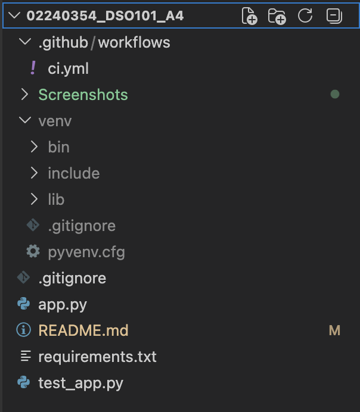
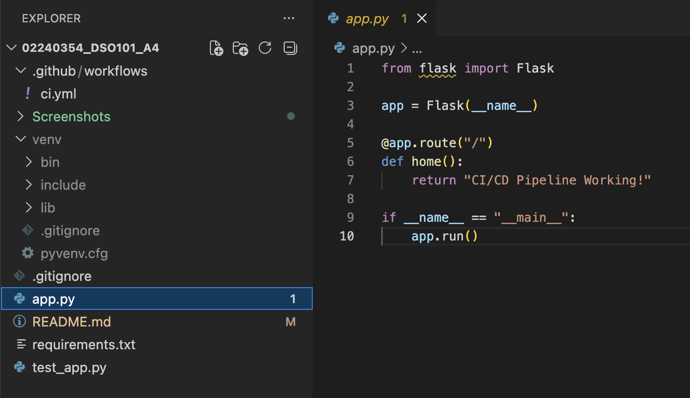
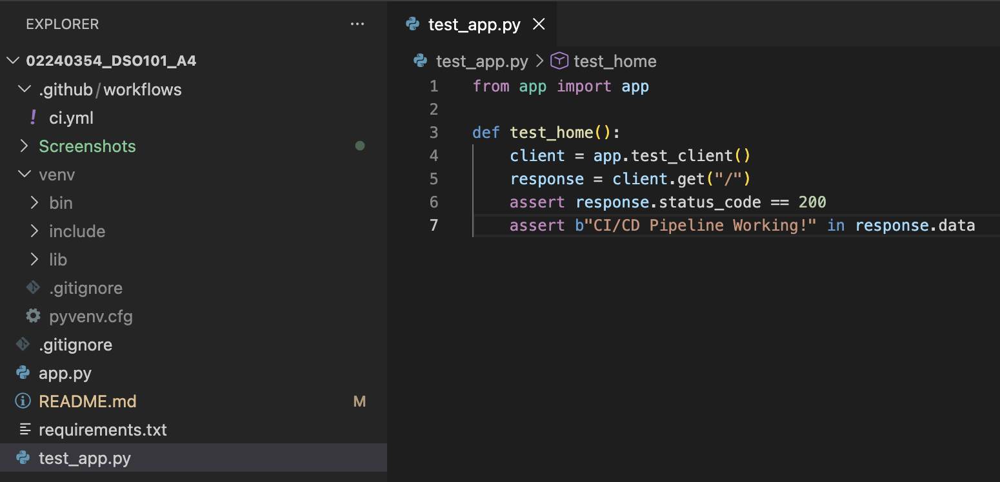
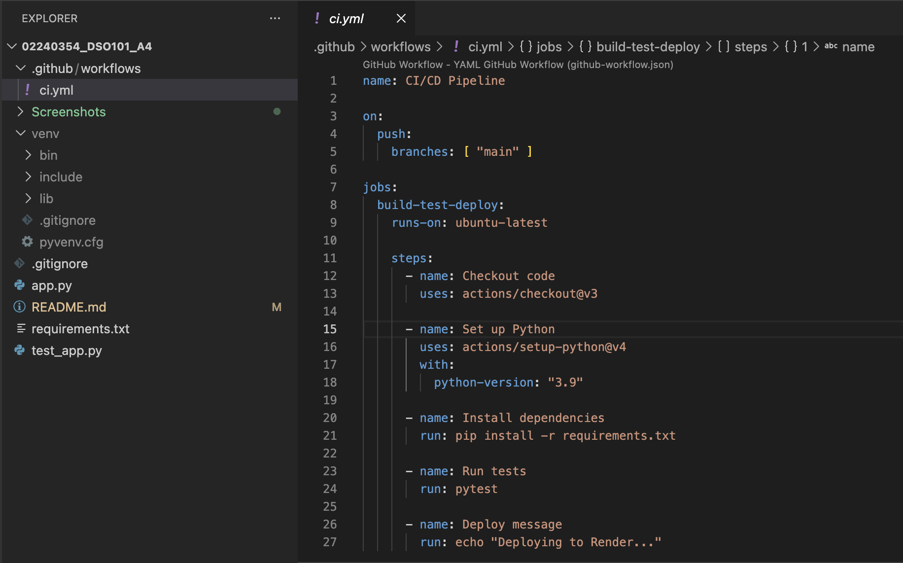
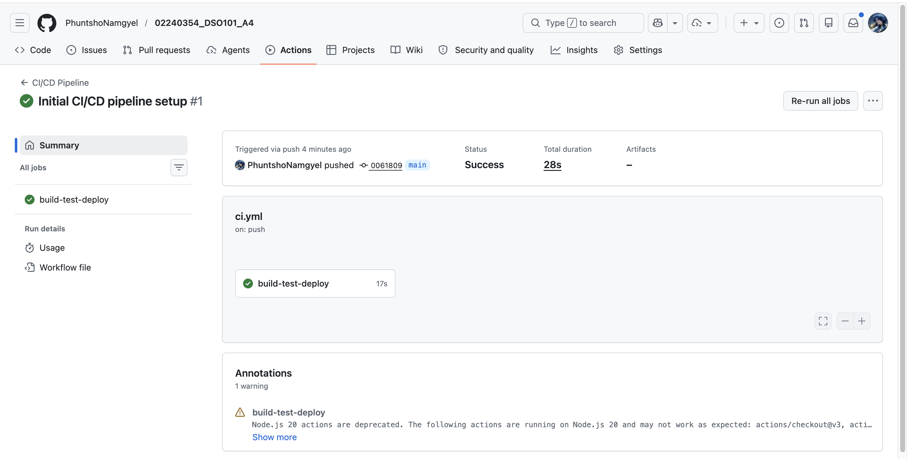
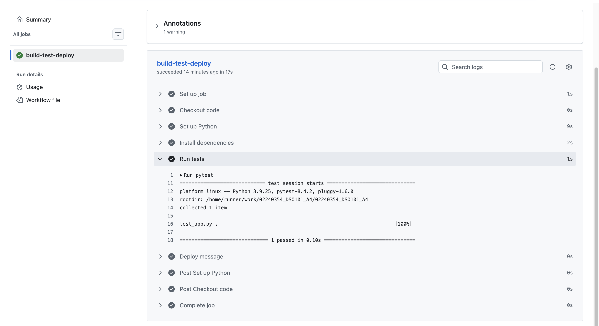
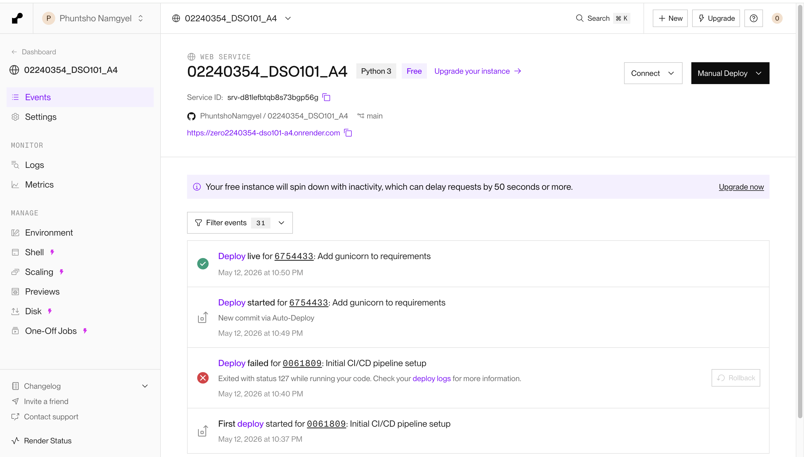
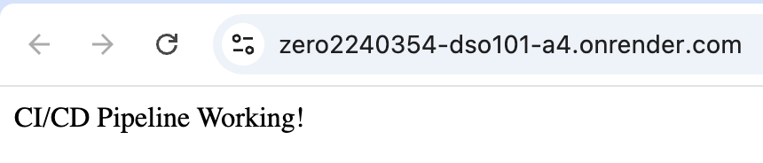

# Assignment 4: Build a Complete CI/CD Pipeline with Testing & Deployment

---

## Steps Taken

**1. Created GitHub Repository and Project Files**
- Created a new GitHub repository and cloned it locally
- Opened the project in VS Code
- Created all required project files: `app.py`, `test_app.py`, `requirements.txt`, and `.github/workflows/ci.yml`

**2. Created Flask Application**
- Created `app.py` with a single route that returns a text response

**3. Created Unit Test**
- Created `test_app.py` using pytest
- Test verifies the app returns a 200 status code and the correct response message

**4. Created GitHub Actions Workflow**
- Created `.github/workflows/ci.yml`
- Workflow triggers automatically on every push to `main` branch
- Pipeline steps:
  - Checkout repository
  - Set up Python 3.9
  - Install dependencies from `requirements.txt`
  - Run tests using pytest
  - Print deploy message

**5. Pushed to GitHub and Verified Pipeline**
- Pushed all files to the `main` branch
- GitHub Actions triggered automatically
- Pipeline completed successfully

**6. Verified Test Output**
- Opened the Run tests step in GitHub Actions
- Confirmed 1 test collected and 1 passed

**7. Deployed to Render**
- Created a new Web Service on Render connected to the GitHub repository
- Set build command to `pip install -r requirements.txt`
- Set start command to `gunicorn app:app`
- Auto-Deploy enabled so every push to `main` triggers a redeployment automatically

**8. Verified Live Application**
- Opened the live URL and confirmed the app is running
- Page displays: CI/CD Pipeline Working!

---

## Challenges Faced

- The initial deployment on Render failed because `gunicorn` was missing from `requirements.txt`. Adding it and pushing again resolved the issue.

---

## Learning Outcomes

- Understood how a CI/CD pipeline automates the entire process from a single `git push` to a live deployment
- Learned how to write and configure GitHub Actions workflow files
- Learned how to write a proper Flask unit test using the test client to simulate HTTP requests
- Understood the difference between a development server and a production server and why Gunicorn is needed for deployment
- Understood how Render auto-deploys on every push to the main branch

---

## Live App URL

https://zero2240354-dso101-a4.onrender.com